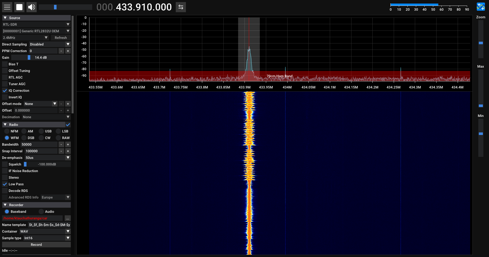

# CC1101_AnalogFM

Transmit unsigned 8-bit audio samples as analog FM using a CC1101 module.

<p align="center">
  
</p>

## Basic use

```cpp
#include <CC1101_AnalogFM.h>

CC1101_AnalogFM radio(15); // CSN, ESP8266 D8 / GPIO15

void setup() {
  Serial.begin(500000);
  radio.begin(433.92f);
  radio.setGain(75); // 0 to 100 percent
}

void loop() {
  radio.stream(Serial);
}
```

`stream()` consumes available bytes from any Arduino `Stream`. Each byte is
treated as unsigned audio: `0` is the negative peak, `128` is the carrier
center, and `255` is the positive peak. The default maximum deviation is the
same narrow range used by the original sketch.

Change the carrier at runtime with `setFrequency(433.92f)`. Gain controls the
audio deviation without changing the carrier frequency.

The CC1101 uses a 26 MHz crystal with the included register profile. Connect
the module's SPI pins to the board's hardware SPI pins, and connect CSN to the
pin passed to the constructor.

See `examples/SerialAudio` for serial audio input and `examples/GeneratedTone`
for a self-contained signal source.

To stream microphone audio from a computer, create a Python virtual environment
and install the dependencies:

```sh
python3 -m venv .venv
source .venv/bin/activate
python -m pip install -r examples/SerialAudio/requirements.txt
```

With the virtual environment active, route the computer microphone to the
board:

```sh
python examples/SerialAudio/stream_audio.py --port /dev/ttyUSB0 --mic
```

Use `--list-devices` to inspect audio inputs and `--device NAME_OR_INDEX` to
select one. `--mic` captures the computer microphone as mono 8 kHz audio and
streams it to the board. Microphone mode is also the default when no `--file`
or `--raw-file` option is given.

To stream an MP3 file instead, install `ffmpeg` and run:

```sh
sudo apt install ffmpeg
python examples/SerialAudio/stream_audio.py \
  --port /dev/ttyUSB0 \
  --file music.mp3
```

The MP3 is first converted to a temporary, board-ready raw file: mono,
unsigned 8-bit, 8 kHz audio. It is then transmitted in real time at exactly
8,000 bytes per second by default. Samples are paced individually so the
500000-baud serial link does not deliver large bursts followed by gaps. The
temporary file is removed afterward.

To save the converted board-ready raw audio first, then stream that raw file:

```sh
python examples/SerialAudio/stream_audio.py \
  --port /dev/ttyUSB0 \
  --file music.mp3 \
  --raw-output music.raw
```

This keeps the converted raw file instead of deleting it. An existing raw file
can be streamed directly with `--raw-file music.raw`.
